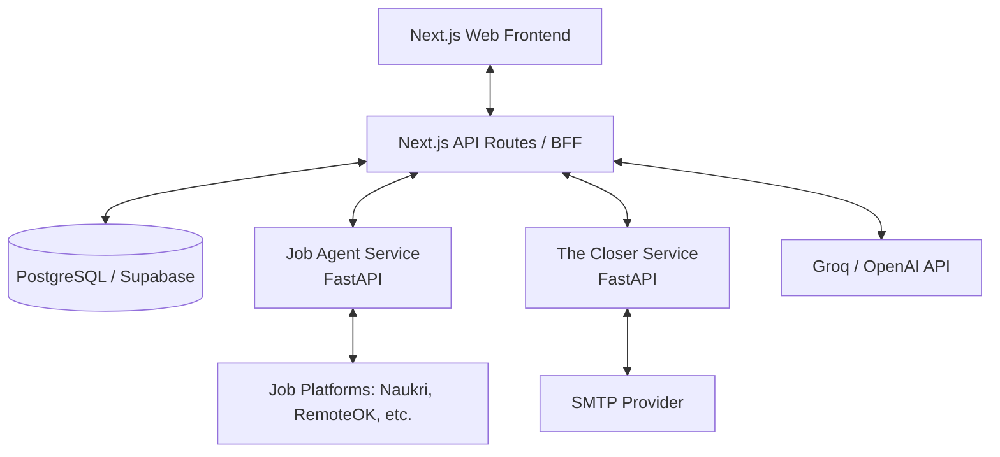

# Architecture Overview: AI Job Application Engine

This document outlines the detailed system architecture for the unified AI Job Application Engine, which integrates the Job Agent, Resume Builder, and The Closer (Cold Email Parser) into a single, cohesive platform.

## 1. High-Level Architecture

The system follows a modern decoupled architecture, utilizing a **Next.js frontend** for the unified user interface and orchestration, and **Python microservices** to handle the heavy lifting for scraping and email generation.

## 2. Core Components

### 2.1 Next.js Frontend & Orchestration Layer
- **Framework**: Next.js (App Router)
- **Role**: Serves as the primary user interface, state manager, and backend-for-frontend (BFF).
- **Responsibilities**:
  - Unified Dashboard: Displays jobs, resumes, and email campaigns.
  - Resume Builder: Manages the interactive tailoring of resumes.
  - Orchestration: Calls Python microservices for jobs and emails, and coordinates the LLM for gap analysis and content generation.

### 2.2 Job Agent Microservice (Python / FastAPI)
- **Framework**: FastAPI
- **Role**: Wraps the existing `Job Agent` CLI into a scalable REST API.
- **Endpoints**:
  - `POST /api/v1/scrape`: Accepts search parameters (title, location, sources) and returns a normalized JSON list of job opportunities.
- **Responsibilities**: Executing BeautifulSoup, requests, and Firecrawl scraping tasks asynchronously.

### 2.3 The Closer Microservice (Python / FastAPI)
- **Framework**: FastAPI
- **Role**: Wraps the existing `The Closer` CLI into a web service.
- **Endpoints**:
  - `POST /api/v1/email/generate`: Accepts contact context and returns a drafted email.
  - `POST /api/v1/email/send`: Executes the SMTP send.
- **Responsibilities**: Email formatting, spam checking, and SMTP delivery.

## 3. Data Flow & Execution Pipeline

The integration relies on a seamless flow of data between the isolated modules:

1. **Job Discovery**:
   - User submits a job search on the UI.
   - Next.js calls the Job Agent Service.
   - Service scrapes platforms and returns results.
   - Next.js saves results to the Database.

2. **Resume Tailoring**:
   - User selects a specific Job from the dashboard.
   - Next.js extracts the Job Description and passes it, along with the user's base Resume Profile, to the LLM.
   - LLM performs a gap analysis and rewrites bullets.
   - Next.js saves the `TailoredResume` entity to the Database.

3. **Cold Outreach**:
   - User clicks "Draft Outreach" for a tailored job.
   - Next.js aggregates the Job context, Company name, and Tailored Resume highlights.
   - Next.js calls The Closer Service to generate the email draft.
   - User previews the email in the UI.
   - On approval, Next.js calls The Closer Service to send the email via SMTP.

## 4. Database Schema Overview

We will use a relational database (e.g., PostgreSQL) to persist the state across the pipeline. 

### Core Entities:
* **User**: Profiles, Base Resumes, Authentication credentials.
* **Job Opportunity**: Scraped details (Title, Company, Location, Description, Source URL).
* **Application**: Connects a User to a Job Opportunity. Tracks status (`Discovered`, `Tailoring`, `Outreach Sent`, `Interview`).
* **Tailored Resume**: A snapshot of the specific resume variations created for an Application.
* **Outreach Log**: Tracks email sends, message IDs, status, and associated Application IDs.

## 5. Security & Guardrails

* **Human-in-the-Loop**: The orchestration layer guarantees that while generation is automated, state transitions (e.g., executing the SMTP send) require explicit user approval via the UI.
* **API Security**: Python microservices will sit behind a VPC or require a shared internal secret to ensure they are only accessible by the Next.js API routes.
* **Secret Management**: SMTP credentials and LLM keys will be stored securely in the Next.js environment and passed to the microservices dynamically, or securely managed in the microservice's own environment.

## 6. Deployment Strategy
* **Frontend**: Vercel (for Next.js, API routes, and edge caching).
* **Database**: Supabase or Vercel Postgres.
* **Microservices**: Containerized using Docker and deployed on Render, Railway, or AWS App Runner to handle Python dependencies and long-running scraping tasks.
