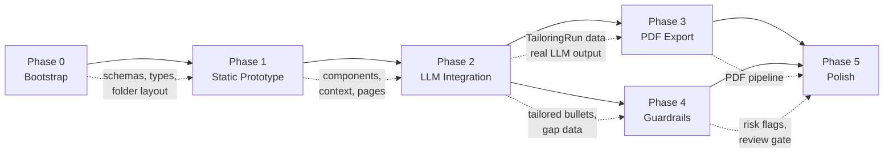

# Resume Shapeshifter — Implementation Plan

> **Source:** [architecture.md](file:///Users/pavan2102/Documents/Documents%20-%20Pavan's%20MacBook%20Pro/Projects/Resume%20Builder/docs/architecture.md) · [ProblemStatement.md](file:///Users/pavan2102/Documents/Documents%20-%20Pavan's%20MacBook%20Pro/Projects/Resume%20Builder/docs/ProblemStatement.md)  
> **Last Updated:** 2026-05-29  
> **Status:** Awaiting Approval

---

## Phase Summary

| Phase | Name                  | Focus                                                   | Main Outcome                                  | Est. Duration |
|-------|-----------------------|---------------------------------------------------------|-----------------------------------------------|---------------|
| **0** | Bootstrap             | Next.js, Zod schemas, folder layout, fixtures           | Foundation before product work                | 1 day         |
| **1** | Static Prototype      | Mock orchestrator, full UI shell, stub APIs             | Paste → Analyze → Side-by-side (no LLM)      | 2–3 days      |
| **2** | LLM Integration       | Prompts, services, orchestrator, real APIs              | Real parse, score, gaps, tailor               | 2–3 days      |
| **3** | PDF Export            | HTML templates + Playwright, export route               | Tailored + comparison PDFs                    | 1–2 days      |
| **4** | Guardrails            | `lib/guardrails.ts`, UI risk/confidence, export checkbox| Truthfulness checks before export             | 1–2 days      |
| **5** | Polish                | PDF/DOCX upload, route split, samples, deploy           | Portfolio-ready demo                          | 2–3 days      |

---

## Cross-Phase Dependency Diagram

> [!IMPORTANT]
> **Phase 3 and Phase 4 can run in parallel** after Phase 2 is complete — they have no mutual dependency. Phase 5 depends on both.

---

## Minimum Vertical Slice (after Phase 2)

After Phase 2 is complete, the product supports the full vertical slice:

1. User pastes resume text + JD text.
2. System calls Groq → returns structured `ResumeProfile` + `JobDescriptionProfile`.
3. System scores the match → `MatchScore` with sub-scores and explanation.
4. System rewrites bullets → `TailoredResume` with per-bullet metadata.
5. System identifies gaps → `GapAnalysis` with importance and suggested actions.
6. User sees side-by-side diff in browser.

**What's missing from full MVP:** PDF export (Phase 3), truthfulness guardrails (Phase 4), polish (Phase 5).

---

---

## Phase 0 — Bootstrap

> **Objective:** Set up the project skeleton — Next.js app, all Zod schemas, folder structure, fixture data, and type exports. No UI, no business logic.  
> **Estimated Duration:** 1 day  
> **Milestone:** **M0** — `npm run dev` serves a blank Next.js app, all schemas compile, fixture data validates.

### Tasks

| #   | Task                                        | Target File(s)                                    |
|-----|---------------------------------------------|---------------------------------------------------|
| 0.1 | Scaffold Next.js 14 project (App Router, TypeScript, Tailwind, ESLint) | Project root                             |
| 0.2 | Install Shadcn UI and add base components (`button`, `textarea`, `card`, `badge`, `separator`, `tabs`, `progress`, `tooltip`) | `components/ui/*`     |
| 0.3 | Install core deps: `zod`, `uuid`            | `package.json`                                    |
| 0.4 | Create folder layout per architecture §13   | All directories: `lib/`, `prompts/`, `context/`, `types/`, `public/sample/` |
| 0.5 | Define all Zod schemas                      | [lib/schemas.ts](file:///Users/pavan2102/Documents/Documents%20-%20Pavan's%20MacBook%20Pro/Projects/Resume%20Builder/lib/schemas.ts) |
| 0.6 | Export inferred TypeScript types             | [types/index.ts](file:///Users/pavan2102/Documents/Documents%20-%20Pavan's%20MacBook%20Pro/Projects/Resume%20Builder/types/index.ts) |
| 0.7 | Create fixture / mock data file             | [lib/fixtures.ts](file:///Users/pavan2102/Documents/Documents%20-%20Pavan's%20MacBook%20Pro/Projects/Resume%20Builder/lib/fixtures.ts) |
| 0.8 | Create sample resume and JD text files      | `public/sample/sample-resume.txt`, `public/sample/sample-jd.txt` |
| 0.9 | Create `.env.local` with placeholder `GROQ_API_KEY` | `.env.local`                             |
| 0.10| Configure root layout with Inter font, metadata, dark mode class | [app/layout.tsx](file:///Users/pavan2102/Documents/Documents%20-%20Pavan's%20MacBook%20Pro/Projects/Resume%20Builder/app/layout.tsx) |

### Deliverables & Acceptance Criteria

- [ ] `npm run dev` starts successfully on `localhost:3000`.
- [ ] `npx tsc --noEmit` passes with zero errors.
- [ ] All 7 schemas compile and export types: `ResumeProfile`, `JobDescriptionProfile`, `MatchScore`, `BulletRewrite`, `TailoredResume`, `GapItem`, `GapAnalysis`, `TailoringRun`.
- [ ] Fixture data in `lib/fixtures.ts` validates against all schemas at import time (runtime assertion).
- [ ] Folder structure matches architecture §13 (all directories exist, even if files are empty stubs).

### Exit Gate

✅ All schemas compile, fixture validates, `npm run dev` serves, `tsc --noEmit` clean.

---

### Risk Checklist — Phase 0

| Risk                                        | Mitigation                                                     |
|---------------------------------------------|----------------------------------------------------------------|
| Shadcn init fails on Next.js 14 App Router  | Use `npx shadcn@latest init` with `--defaults` flag           |
| Tailwind config conflicts                   | Let `create-next-app` generate it; Shadcn extends it          |

---

---

## Phase 1 — Static Prototype

> **Objective:** Build every UI screen with mock data. A user can navigate the full flow (Paste → Analyze → Results → Diff → Export) using the fixture `TailoringRun`. Backend routes return mocked responses.  
> **Estimated Duration:** 2–3 days  
> **Milestone:** **M1** — Full navigable UI demo with fixture data. No LLM calls.

### Tasks

| #    | Task                                                          | Target File(s)                                              |
|------|---------------------------------------------------------------|-------------------------------------------------------------|
| **Context & State** |                                                  |                                                             |
| 1.1  | Create `TailoringSessionContext` with `useReducer`            | [context/TailoringSessionContext.tsx](file:///Users/pavan2102/Documents/Documents%20-%20Pavan's%20MacBook%20Pro/Projects/Resume%20Builder/context/TailoringSessionContext.tsx) |
| 1.2  | Wire context provider into root layout                        | [app/layout.tsx](file:///Users/pavan2102/Documents/Documents%20-%20Pavan's%20MacBook%20Pro/Projects/Resume%20Builder/app/layout.tsx) |
| **Stub API Routes** |                                                |                                                             |
| 1.3  | Stub `POST /api/parse/resume` → returns fixture `parsedResume` | [app/api/parse/resume/route.ts](file:///Users/pavan2102/Documents/Documents%20-%20Pavan's%20MacBook%20Pro/Projects/Resume%20Builder/app/api/parse/resume/route.ts) |
| 1.4  | Stub `POST /api/parse/jd` → returns fixture `parsedJD`        | [app/api/parse/jd/route.ts](file:///Users/pavan2102/Documents/Documents%20-%20Pavan's%20MacBook%20Pro/Projects/Resume%20Builder/app/api/parse/jd/route.ts) |
| 1.5  | Stub `POST /api/score` → returns fixture `originalScore`      | [app/api/score/route.ts](file:///Users/pavan2102/Documents/Documents%20-%20Pavan's%20MacBook%20Pro/Projects/Resume%20Builder/app/api/score/route.ts) |
| 1.6  | Stub `POST /api/tailor` → returns fixture `tailoredResume` + `gapAnalysis` | [app/api/tailor/route.ts](file:///Users/pavan2102/Documents/Documents%20-%20Pavan's%20MacBook%20Pro/Projects/Resume%20Builder/app/api/tailor/route.ts) |
| **Mock Orchestrator** |                                              |                                                             |
| 1.7  | Create `lib/orchestrator.ts` — sequence of fetch calls (parse → score → tailor) used by frontend | [lib/orchestrator.ts](file:///Users/pavan2102/Documents/Documents%20-%20Pavan's%20MacBook%20Pro/Projects/Resume%20Builder/lib/orchestrator.ts) |
| **Components** |                                                     |                                                             |
| 1.8  | `ResumeInput` — textarea + file upload UI (upload non-functional) + "Load Sample" button + char count | [components/ResumeInput.tsx](file:///Users/pavan2102/Documents/Documents%20-%20Pavan's%20MacBook%20Pro/Projects/Resume%20Builder/components/ResumeInput.tsx) |
| 1.9  | `JDInput` — textarea + "Load Sample" button                   | [components/JDInput.tsx](file:///Users/pavan2102/Documents/Documents%20-%20Pavan's%20MacBook%20Pro/Projects/Resume%20Builder/components/JDInput.tsx) |
| 1.10 | `AnalyzeButton` — calls orchestrator, updates context          | [components/AnalyzeButton.tsx](file:///Users/pavan2102/Documents/Documents%20-%20Pavan's%20MacBook%20Pro/Projects/Resume%20Builder/components/AnalyzeButton.tsx) |
| 1.11 | `ScoreCard` — circular/radial score + sub-score table + explanation text | [components/ScoreCard.tsx](file:///Users/pavan2102/Documents/Documents%20-%20Pavan's%20MacBook%20Pro/Projects/Resume%20Builder/components/ScoreCard.tsx) |
| 1.12 | `JDSummaryCard` — extracted JD info: title, company, skills badges, responsibilities list | [components/JDSummaryCard.tsx](file:///Users/pavan2102/Documents/Documents%20-%20Pavan's%20MacBook%20Pro/Projects/Resume%20Builder/components/JDSummaryCard.tsx) |
| 1.13 | `GapAnalysis` — gap list sorted by importance, color-coded badges, suggested actions | [components/GapAnalysis.tsx](file:///Users/pavan2102/Documents/Documents%20-%20Pavan's%20MacBook%20Pro/Projects/Resume%20Builder/components/GapAnalysis.tsx) |
| 1.14 | `BulletCard` — single bullet with `changeReason`, `keywordsAddressed` badges, `confidence` badge, `riskFlag` box | [components/BulletCard.tsx](file:///Users/pavan2102/Documents/Documents%20-%20Pavan's%20MacBook%20Pro/Projects/Resume%20Builder/components/BulletCard.tsx) |
| 1.15 | `SideBySideDiff` — two-column layout, renders `BulletCard` per rewritten bullet | [components/SideBySideDiff.tsx](file:///Users/pavan2102/Documents/Documents%20-%20Pavan's%20MacBook%20Pro/Projects/Resume%20Builder/components/SideBySideDiff.tsx) |
| 1.16 | `PDFExportButton` — disabled placeholder with "Coming in Phase 3" tooltip | [components/PDFExportButton.tsx](file:///Users/pavan2102/Documents/Documents%20-%20Pavan's%20MacBook%20Pro/Projects/Resume%20Builder/components/PDFExportButton.tsx) |
| **Pages** |                                                          |                                                             |
| 1.17 | Landing page — hero, CTA → `/tailor`, 3-step "How it works"  | [app/page.tsx](file:///Users/pavan2102/Documents/Documents%20-%20Pavan's%20MacBook%20Pro/Projects/Resume%20Builder/app/page.tsx) |
| 1.18 | Input page — `ResumeInput` + `JDInput` + `AnalyzeButton`     | [app/tailor/page.tsx](file:///Users/pavan2102/Documents/Documents%20-%20Pavan's%20MacBook%20Pro/Projects/Resume%20Builder/app/tailor/page.tsx) |
| 1.19 | Results page — `ScoreCard` (original) + `JDSummaryCard` + `GapAnalysis` + "Generate Tailored Resume" button | [app/tailor/results/page.tsx](file:///Users/pavan2102/Documents/Documents%20-%20Pavan's%20MacBook%20Pro/Projects/Resume%20Builder/app/tailor/results/page.tsx) |
| 1.20 | Diff page — `SideBySideDiff` + `ScoreCard` (before/after) + "Export" button | [app/tailor/diff/page.tsx](file:///Users/pavan2102/Documents/Documents%20-%20Pavan's%20MacBook%20Pro/Projects/Resume%20Builder/app/tailor/diff/page.tsx) |
| 1.21 | Export page — `PDFExportButton` (disabled) + run summary     | [app/tailor/export/page.tsx](file:///Users/pavan2102/Documents/Documents%20-%20Pavan's%20MacBook%20Pro/Projects/Resume%20Builder/app/tailor/export/page.tsx) |

### Deliverables & Acceptance Criteria

- [ ] User can navigate: `/` → `/tailor` → `/tailor/results` → `/tailor/diff` → `/tailor/export`.
- [ ] "Load Sample" buttons populate text areas from fixture files.
- [ ] `AnalyzeButton` calls stub APIs, populates context, navigates to results.
- [ ] `ScoreCard` renders overall score (58) with sub-score breakdown and explanation.
- [ ] `JDSummaryCard` renders extracted JD: title, company, skills badges, responsibilities.
- [ ] `GapAnalysis` shows ≥ 3 gaps with importance badges (red/amber/gray) and suggested actions.
- [ ] `SideBySideDiff` shows original vs tailored bullets in two columns with metadata.
- [ ] UI is visually polished (dark mode, proper typography, cohesive color palette) — not a wireframe.
- [ ] `npx tsc --noEmit` passes.

### Exit Gate

✅ Full UI flow works end-to-end with fixture data. All components render correctly. UI looks production-quality.

---

### Risk Checklist — Phase 1

| Risk                                           | Mitigation                                                  |
|------------------------------------------------|-------------------------------------------------------------|
| Context state lost on page navigation          | Use `useContext` in every page; consider `localStorage` backup |
| Two-column diff layout breaks on narrow screens | Set `min-width: 768px` or stack columns on mobile           |
| Stub APIs mask real latency concerns           | Add artificial 500ms delay to stubs to simulate real behavior |

---

---

## Phase 2 — LLM Integration

> **Objective:** Replace all stub API routes with real Groq calls. Build the LLM client wrapper, all 6 prompt files, 5 service functions, and wire them into the existing API routes. Every button triggers a real LLM call.  
> **Estimated Duration:** 2–3 days  
> **Milestone:** **M2** — Paste a real resume + real JD → get real scores, real rewrites, real gaps. Full vertical slice.

### Tasks

| #    | Task                                                            | Target File(s)                                            |
|------|-----------------------------------------------------------------|-----------------------------------------------------------|
| **LLM Client** |                                                        |                                                           |
| 2.1  | Install Groq SDK: `npm install groq-sdk`                        | `package.json`                                            |
| 2.2  | Create LLM client wrapper with Zod validation + retry + backoff | [lib/llm.ts](file:///Users/pavan2102/Documents/Documents%20-%20Pavan's%20MacBook%20Pro/Projects/Resume%20Builder/lib/llm.ts) |
| 2.3  | Define custom `LLMParseError` class                              | [lib/llm.ts](file:///Users/pavan2102/Documents/Documents%20-%20Pavan's%20MacBook%20Pro/Projects/Resume%20Builder/lib/llm.ts) |
| **Prompt Files** |                                                      |                                                           |
| 2.4  | Resume parser prompt — parse raw text → `ResumeProfile` JSON    | [prompts/resume-parser.ts](file:///Users/pavan2102/Documents/Documents%20-%20Pavan's%20MacBook%20Pro/Projects/Resume%20Builder/prompts/resume-parser.ts) |
| 2.5  | JD extraction prompt — extract → `JobDescriptionProfile` JSON   | [prompts/jd-extraction.ts](file:///Users/pavan2102/Documents/Documents%20-%20Pavan's%20MacBook%20Pro/Projects/Resume%20Builder/prompts/jd-extraction.ts) |
| 2.6  | Match scoring prompt — score → `MatchScore` JSON (include weight guidelines 35/25/20/10/10) | [prompts/match-scoring.ts](file:///Users/pavan2102/Documents/Documents%20-%20Pavan's%20MacBook%20Pro/Projects/Resume%20Builder/prompts/match-scoring.ts) |
| 2.7  | Bullet rewriter prompt — rewrite → `TailoredResume` JSON (embed truthfulness rules) | [prompts/bullet-rewriter.ts](file:///Users/pavan2102/Documents/Documents%20-%20Pavan's%20MacBook%20Pro/Projects/Resume%20Builder/prompts/bullet-rewriter.ts) |
| 2.8  | Gap analysis prompt — analyze → `GapAnalysis` JSON              | [prompts/gap-analysis.ts](file:///Users/pavan2102/Documents/Documents%20-%20Pavan's%20MacBook%20Pro/Projects/Resume%20Builder/prompts/gap-analysis.ts) |
| 2.9  | Resume assembly prompt (optional for MVP)                       | [prompts/resume-assembly.ts](file:///Users/pavan2102/Documents/Documents%20-%20Pavan's%20MacBook%20Pro/Projects/Resume%20Builder/prompts/resume-assembly.ts) |
| 2.10 | Prompt re-export barrel                                          | [lib/prompts.ts](file:///Users/pavan2102/Documents/Documents%20-%20Pavan's%20MacBook%20Pro/Projects/Resume%20Builder/lib/prompts.ts) |
| **Service Functions** |                                                 |                                                           |
| 2.11 | Resume parsing service — calls LLM with `llama-3.3-70b-versatile`          | [lib/parseResume.ts](file:///Users/pavan2102/Documents/Documents%20-%20Pavan's%20MacBook%20Pro/Projects/Resume%20Builder/lib/parseResume.ts) |
| 2.12 | JD parsing service — calls LLM with `llama-3.3-70b-versatile`              | [lib/parseJD.ts](file:///Users/pavan2102/Documents/Documents%20-%20Pavan's%20MacBook%20Pro/Projects/Resume%20Builder/lib/parseJD.ts) |
| 2.13 | Match scoring service — calls LLM with `llama-3.3-70b-versatile`           | [lib/scoreMatch.ts](file:///Users/pavan2102/Documents/Documents%20-%20Pavan's%20MacBook%20Pro/Projects/Resume%20Builder/lib/scoreMatch.ts) |
| 2.14 | Bullet rewriting service — calls LLM with `llama-3.3-70b-versatile`             | [lib/tailorResume.ts](file:///Users/pavan2102/Documents/Documents%20-%20Pavan's%20MacBook%20Pro/Projects/Resume%20Builder/lib/tailorResume.ts) |
| 2.15 | Gap analysis service — calls LLM with `llama-3.3-70b-versatile`            | [lib/analyzeGaps.ts](file:///Users/pavan2102/Documents/Documents%20-%20Pavan's%20MacBook%20Pro/Projects/Resume%20Builder/lib/analyzeGaps.ts) |
| **Real API Routes** |                                                   |                                                           |
| 2.16 | Replace stub `/api/parse/resume` with real service call + Zod input validation (max 10k chars) | [app/api/parse/resume/route.ts](file:///Users/pavan2102/Documents/Documents%20-%20Pavan's%20MacBook%20Pro/Projects/Resume%20Builder/app/api/parse/resume/route.ts) |
| 2.17 | Replace stub `/api/parse/jd` with real service call + Zod input validation (max 5k chars)    | [app/api/parse/jd/route.ts](file:///Users/pavan2102/Documents/Documents%20-%20Pavan's%20MacBook%20Pro/Projects/Resume%20Builder/app/api/parse/jd/route.ts) |
| 2.18 | Replace stub `/api/score` with real service call               | [app/api/score/route.ts](file:///Users/pavan2102/Documents/Documents%20-%20Pavan's%20MacBook%20Pro/Projects/Resume%20Builder/app/api/score/route.ts) |
| 2.19 | Replace stub `/api/tailor` with real service calls (tailor + gap in parallel via `Promise.all`) | [app/api/tailor/route.ts](file:///Users/pavan2102/Documents/Documents%20-%20Pavan's%20MacBook%20Pro/Projects/Resume%20Builder/app/api/tailor/route.ts) |
| 2.20 | Create Zod request validation helper                            | [lib/validateBody.ts](file:///Users/pavan2102/Documents/Documents%20-%20Pavan's%20MacBook%20Pro/Projects/Resume%20Builder/lib/validateBody.ts) |
| **Orchestrator** |                                                      |                                                           |
| 2.21 | Update `lib/orchestrator.ts` — now calls real APIs, adds loading/error status transitions | [lib/orchestrator.ts](file:///Users/pavan2102/Documents/Documents%20-%20Pavan's%20MacBook%20Pro/Projects/Resume%20Builder/lib/orchestrator.ts) |
| 2.22 | Update `AnalyzeButton` and results page "Generate" button to use real orchestrator | [components/AnalyzeButton.tsx](file:///Users/pavan2102/Documents/Documents%20-%20Pavan's%20MacBook%20Pro/Projects/Resume%20Builder/components/AnalyzeButton.tsx), [app/tailor/results/page.tsx](file:///Users/pavan2102/Documents/Documents%20-%20Pavan's%20MacBook%20Pro/Projects/Resume%20Builder/app/tailor/results/page.tsx) |
| 2.23 | Add basic loading spinners on buttons during API calls          | Multiple components                                       |

### Deliverables & Acceptance Criteria

- [ ] Pasting a real resume + real JD and clicking "Analyze" calls Groq and returns structured data.
- [ ] `ScoreCard` shows a real match score (not fixture data).
- [ ] `JDSummaryCard` shows real extracted JD data (job title, skills, etc.).
- [ ] `GapAnalysis` shows real gaps derived from the actual resume and JD.
- [ ] `SideBySideDiff` shows real rewrites with real `changeReason`, `keywordsAddressed`, and `confidence`.
- [ ] All LLM responses pass Zod schema validation (no runtime errors in console).
- [ ] Invalid LLM JSON is retried automatically (up to 2x) — verify by checking retry log output.
- [ ] API validation errors return 400 with descriptive error messages.
- [ ] Loading spinners appear during all API calls.

### Exit Gate

✅ Full vertical slice: real resume + real JD → real scores, rewrites, and gaps — all rendered in the UI. No stub data.

---

### Testing Strategy — Phase 2

| Test Type          | What to Test                                              | How                                     |
|--------------------|-----------------------------------------------------------|-----------------------------------------|
| **Manual**         | Paste sample resume + JD → verify scores and rewrites     | Browser, check console for errors       |
| **Schema**         | LLM responses validate against Zod schemas                | Assertion in `callLLM` wrapper          |
| **Retry**          | Malformed JSON triggers retry logic                       | Temporarily corrupt schema, observe log |
| **Edge case**      | Empty resume / empty JD                                   | Submit empty text, check 400 response   |

### Risk Checklist — Phase 2

| Risk                                     | Mitigation                                                        |
|------------------------------------------|-------------------------------------------------------------------|
| LLM returns invalid JSON                 | `callLLM` retries 2x with Zod error context appended to prompt   |
| LLM adds invented experience             | Truthfulness rules in every prompt (architecture §14.2)           |
| Token limit exceeded on long resumes     | Log token count; add chunking in Phase 4 if needed                |
| Rate limit / 429 from Groq             | Exponential backoff in `callLLM` wrapper                          |
| Score feels arbitrary                    | Include `explanation` string; show sub-score breakdown            |

---

---

## Phase 3 — PDF Export

> **Objective:** Generate two downloadable PDFs: (1) a clean tailored resume PDF, (2) a side-by-side comparison PDF with scores, gaps, bullet explanations, and disclaimer. Uses `@react-pdf/renderer` in a Node.js API route.  
> **Estimated Duration:** 1–2 days  
> **Milestone:** **M3** — Click "Download" → real PDF saved to disk with correct content.

### Tasks

| #    | Task                                                            | Target File(s)                                            |
|------|-----------------------------------------------------------------|-----------------------------------------------------------|
| 3.1  | Install PDF deps: `@react-pdf/renderer`                         | `package.json`                                            |
| 3.2  | Create tailored resume PDF React component (single-column, ATS-friendly) | [components/pdf/TailoredResumePDF.tsx](file:///Users/pavan2102/Documents/Documents%20-%20Pavan's%20MacBook%20Pro/Projects/Resume%20Builder/components/pdf/TailoredResumePDF.tsx) |
| 3.3  | Create comparison PDF React component (header + scores + two-column bullets + gaps + disclaimer) | [components/pdf/ComparisonPDF.tsx](file:///Users/pavan2102/Documents/Documents%20-%20Pavan's%20MacBook%20Pro/Projects/Resume%20Builder/components/pdf/ComparisonPDF.tsx) |
| 3.4  | Create PDF generation service (`renderToBuffer`)                 | [lib/generatePDF.ts](file:///Users/pavan2102/Documents/Documents%20-%20Pavan's%20MacBook%20Pro/Projects/Resume%20Builder/lib/generatePDF.ts) |
| 3.5  | Implement `POST /api/export/pdf` route                           | [app/api/export/pdf/route.ts](file:///Users/pavan2102/Documents/Documents%20-%20Pavan's%20MacBook%20Pro/Projects/Resume%20Builder/app/api/export/pdf/route.ts) |
| 3.6  | Update `PDFExportButton` — two real download buttons + loading state | [components/PDFExportButton.tsx](file:///Users/pavan2102/Documents/Documents%20-%20Pavan's%20MacBook%20Pro/Projects/Resume%20Builder/components/PDFExportButton.tsx) |
| 3.7  | Update export page — show run summary + both download buttons + "Start Over" | [app/tailor/export/page.tsx](file:///Users/pavan2102/Documents/Documents%20-%20Pavan's%20MacBook%20Pro/Projects/Resume%20Builder/app/tailor/export/page.tsx) |

### Deliverables & Acceptance Criteria

- [ ] "Download Tailored Resume PDF" button downloads a real PDF with tailored resume content.
- [ ] "Download Comparison PDF" button downloads a real side-by-side PDF.
- [ ] Comparison PDF includes: header (job title @ company), original → tailored score, JD summary, two-column bullets, gap analysis, disclaimer.
- [ ] Both PDFs include correct scores from the current session (not fixture).
- [ ] Disclaimer footer appears on every page: *"Review all content before use."*
- [ ] PDFs open correctly in macOS Preview and Chrome PDF viewer.
- [ ] PDF generation doesn't crash when optional sections (projects, certifications) are missing.
- [ ] "Start Over" button resets context and navigates to `/tailor`.

### Exit Gate

✅ Both PDFs download and contain correct, complete data. Disclaimer present on every page.

---

### Risk Checklist — Phase 3

| Risk                                     | Mitigation                                                     |
|------------------------------------------|----------------------------------------------------------------|
| `@react-pdf/renderer` doesn't work in Edge Runtime | Use Node.js runtime in route: `export const runtime = "nodejs"` |
| Long resumes overflow PDF pages          | Use `<View wrap>` and `<Page break>` in React PDF components   |
| PDF styling looks unprofessional         | Phase 5 polish pass will refine; keep it clean-but-basic now   |

---

---

## Phase 4 — Guardrails

> **Objective:** Add post-LLM truthfulness validation, risk/confidence UI indicators, and a pre-export review gate that blocks download until the user has reviewed all flagged bullets.  
> **Estimated Duration:** 1–2 days  
> **Milestone:** **M4** — Risk-flagged bullets require acknowledgment; export blocked until checklist complete.

### Tasks

| #    | Task                                                            | Target File(s)                                            |
|------|-----------------------------------------------------------------|-----------------------------------------------------------|
| **Post-LLM Validation** |                                              |                                                           |
| 4.1  | Create guardrails module — detect new nouns in tailored bullets not present in original resume | [lib/guardrails.ts](file:///Users/pavan2102/Documents/Documents%20-%20Pavan's%20MacBook%20Pro/Projects/Resume%20Builder/lib/guardrails.ts) |
| 4.2  | Wire `guardrails.ts` into `/api/tailor` route — run after LLM returns, downgrade confidence + set riskFlag on suspicious bullets | [app/api/tailor/route.ts](file:///Users/pavan2102/Documents/Documents%20-%20Pavan's%20MacBook%20Pro/Projects/Resume%20Builder/app/api/tailor/route.ts) |
| 4.3  | Harden Zod schemas: add `.int()` to scores, `.max(200)` to riskFlag, `.default("medium")` to confidence | [lib/schemas.ts](file:///Users/pavan2102/Documents/Documents%20-%20Pavan's%20MacBook%20Pro/Projects/Resume%20Builder/lib/schemas.ts) |
| **Prompt Hardening** |                                                  |                                                           |
| 4.4  | Audit all 5 prompts — ensure every one includes the full truthfulness rule block (architecture §14.2) | `prompts/*.ts`                                            |
| 4.5  | Add JSON schema hints inside each prompt for stricter LLM output compliance | `prompts/*.ts`                                            |
| 4.6  | Add `canSafelyAdd` reasoning rule to gap analysis prompt        | [prompts/gap-analysis.ts](file:///Users/pavan2102/Documents/Documents%20-%20Pavan's%20MacBook%20Pro/Projects/Resume%20Builder/prompts/gap-analysis.ts) |
| **UI — Risk/Confidence Signals** |                                      |                                                           |
| 4.7  | Update `BulletCard` — amber "⚠ Low Confidence" badge for `confidence: "low"`, red "🚩 Needs Review" banner for `riskFlag`, checkbox for flagged bullets | [components/BulletCard.tsx](file:///Users/pavan2102/Documents/Documents%20-%20Pavan's%20MacBook%20Pro/Projects/Resume%20Builder/components/BulletCard.tsx) |
| 4.8  | Update `GapAnalysis` — "🚫 Do not add unless true" for `canSafelyAdd: false`, "✓ Can safely add" for `true` | [components/GapAnalysis.tsx](file:///Users/pavan2102/Documents/Documents%20-%20Pavan's%20MacBook%20Pro/Projects/Resume%20Builder/components/GapAnalysis.tsx) |
| **Pre-Export Review Gate** |                                            |                                                           |
| 4.9  | Create `ExportReviewChecklist` — 4 mandatory checkboxes before export is enabled | [components/ExportReviewChecklist.tsx](file:///Users/pavan2102/Documents/Documents%20-%20Pavan's%20MacBook%20Pro/Projects/Resume%20Builder/components/ExportReviewChecklist.tsx) |
| 4.10 | Update export page — gate `PDFExportButton` behind review checklist | [app/tailor/export/page.tsx](file:///Users/pavan2102/Documents/Documents%20-%20Pavan's%20MacBook%20Pro/Projects/Resume%20Builder/app/tailor/export/page.tsx) |
| **Input Validation** |                                                  |                                                           |
| 4.11 | Enforce character limits in API routes: resume ≤ 10k, JD ≤ 5k → 400 on exceed | [app/api/parse/resume/route.ts](file:///Users/pavan2102/Documents/Documents%20-%20Pavan's%20MacBook%20Pro/Projects/Resume%20Builder/app/api/parse/resume/route.ts), [app/api/parse/jd/route.ts](file:///Users/pavan2102/Documents/Documents%20-%20Pavan's%20MacBook%20Pro/Projects/Resume%20Builder/app/api/parse/jd/route.ts) |

### Deliverables & Acceptance Criteria

- [ ] Tailored bullets that introduce nouns not in the original resume get `riskFlag: "NEEDS_REVIEW"` automatically via `guardrails.ts`.
- [ ] Low-confidence bullets show amber "⚠ Low Confidence" badge + italic text in diff view.
- [ ] Risk-flagged bullets show red "🚩 Needs Review" banner + mandatory checkbox.
- [ ] All risk-flagged bullet checkboxes must be checked before export is enabled.
- [ ] `ExportReviewChecklist` has 4 items; all must be checked to show download buttons.
- [ ] Submitting resume text > 10,000 chars returns 400 with a descriptive error (not 500).
- [ ] `canSafelyAdd: false` gaps show "🚫 Do not add unless true" in red.

### Exit Gate

✅ Guardrails block fabricated content. Export is gated behind user review. Input validation catches oversized payloads.

---

### Risk Checklist — Phase 4

| Risk                                     | Mitigation                                                        |
|------------------------------------------|-------------------------------------------------------------------|
| Guardrails too aggressive (false positives) | Only flag new *proper nouns* (capitalized words, tech names); ignore common verbs/adverbs |
| Checklist feels like friction             | Explain why each checkbox matters in tooltip; keep to 4 items max |
| LLM ignores truthfulness rules            | Post-LLM validation in `guardrails.ts` catches what prompts miss |

---

---

## Phase 5 — Polish

> **Objective:** Portfolio-quality product: file upload for PDF/DOCX resumes, skeleton loading states, error toasts, sample data for instant demo, refined PDF styling, and deploy-readiness.  
> **Estimated Duration:** 2–3 days  
> **Milestone:** **M5** — Complete end-to-end demo using sample data. Portfolio-ready. Definition of Done (ProblemStatement §19) fully met.

### Tasks

| #    | Task                                                            | Target File(s)                                            |
|------|-----------------------------------------------------------------|-----------------------------------------------------------|
| **File Upload** |                                                       |                                                           |
| 5.1  | Install document parsing deps: `pdf-parse`, `mammoth`           | `package.json`                                            |
| 5.2  | Create file parsing utility — extract text from PDF and DOCX uploads | [lib/parseFile.ts](file:///Users/pavan2102/Documents/Documents%20-%20Pavan's%20MacBook%20Pro/Projects/Resume%20Builder/lib/parseFile.ts) |
| 5.3  | Update `ResumeInput` — make file upload functional (PDF/DOCX, max 5MB) | [components/ResumeInput.tsx](file:///Users/pavan2102/Documents/Documents%20-%20Pavan's%20MacBook%20Pro/Projects/Resume%20Builder/components/ResumeInput.tsx) |
| 5.4  | Add file upload API route (or handle client-side with FileReader) | [app/api/upload/route.ts](file:///Users/pavan2102/Documents/Documents%20-%20Pavan's%20MacBook%20Pro/Projects/Resume%20Builder/app/api/upload/route.ts) (optional) |
| **Loading States** |                                                    |                                                           |
| 5.5  | Create skeleton components: `SkeletonScoreCard`, `SkeletonGapList`, `SkeletonBulletCard` | [components/skeletons/](file:///Users/pavan2102/Documents/Documents%20-%20Pavan's%20MacBook%20Pro/Projects/Resume%20Builder/components/skeletons/) |
| 5.6  | Wire skeletons into results/diff pages based on context `status` | [app/tailor/results/page.tsx](file:///Users/pavan2102/Documents/Documents%20-%20Pavan's%20MacBook%20Pro/Projects/Resume%20Builder/app/tailor/results/page.tsx), [app/tailor/diff/page.tsx](file:///Users/pavan2102/Documents/Documents%20-%20Pavan's%20MacBook%20Pro/Projects/Resume%20Builder/app/tailor/diff/page.tsx) |
| 5.7  | Add 4-step progress bar (Parse → Score → Tailor → Export) tracking context status | [components/ProgressBar.tsx](file:///Users/pavan2102/Documents/Documents%20-%20Pavan's%20MacBook%20Pro/Projects/Resume%20Builder/components/ProgressBar.tsx) |
| **Error Handling UI** |                                                 |                                                           |
| 5.8  | Install Shadcn `sonner` for toast notifications                  | `package.json` / Shadcn CLI                               |
| 5.9  | Add `<Toaster />` to root layout                                | [app/layout.tsx](file:///Users/pavan2102/Documents/Documents%20-%20Pavan's%20MacBook%20Pro/Projects/Resume%20Builder/app/layout.tsx) |
| 5.10 | Wire error toasts in orchestrator: timeout, rate limit, schema errors | [lib/orchestrator.ts](file:///Users/pavan2102/Documents/Documents%20-%20Pavan's%20MacBook%20Pro/Projects/Resume%20Builder/lib/orchestrator.ts) |
| 5.11 | Add "Retry" button on results page when `status === "error"`     | [app/tailor/results/page.tsx](file:///Users/pavan2102/Documents/Documents%20-%20Pavan's%20MacBook%20Pro/Projects/Resume%20Builder/app/tailor/results/page.tsx) |
| **Sample Data & Demo Mode** |                                          |                                                           |
| 5.12 | Write realistic sample resume text (2-job mid-career SWE)        | [public/sample/sample-resume.txt](file:///Users/pavan2102/Documents/Documents%20-%20Pavan's%20MacBook%20Pro/Projects/Resume%20Builder/public/sample/sample-resume.txt) |
| 5.13 | Write realistic sample JD text (SWE with required/preferred skills) | [public/sample/sample-jd.txt](file:///Users/pavan2102/Documents/Documents%20-%20Pavan's%20MacBook%20Pro/Projects/Resume%20Builder/public/sample/sample-jd.txt) |
| 5.14 | Wire "Load Sample" buttons to fetch from `/sample/` on click     | [components/ResumeInput.tsx](file:///Users/pavan2102/Documents/Documents%20-%20Pavan's%20MacBook%20Pro/Projects/Resume%20Builder/components/ResumeInput.tsx), [components/JDInput.tsx](file:///Users/pavan2102/Documents/Documents%20-%20Pavan's%20MacBook%20Pro/Projects/Resume%20Builder/components/JDInput.tsx) |
| 5.15 | Add dismissible "Demo Mode" banner when sample data is loaded    | [components/DemoModeBanner.tsx](file:///Users/pavan2102/Documents/Documents%20-%20Pavan's%20MacBook%20Pro/Projects/Resume%20Builder/components/DemoModeBanner.tsx) |
| **PDF Styling** |                                                       |                                                           |
| 5.16 | Polish tailored resume PDF: spacing, font sizes, section headers | [components/pdf/TailoredResumePDF.tsx](file:///Users/pavan2102/Documents/Documents%20-%20Pavan's%20MacBook%20Pro/Projects/Resume%20Builder/components/pdf/TailoredResumePDF.tsx) |
| 5.17 | Polish comparison PDF: page numbers, confidence color-coding, keyword highlights | [components/pdf/ComparisonPDF.tsx](file:///Users/pavan2102/Documents/Documents%20-%20Pavan's%20MacBook%20Pro/Projects/Resume%20Builder/components/pdf/ComparisonPDF.tsx) |
| **Optional Export Formats** |                                           |                                                           |
| 5.18 | Markdown export utility                                          | [lib/exportMarkdown.ts](file:///Users/pavan2102/Documents/Documents%20-%20Pavan's%20MacBook%20Pro/Projects/Resume%20Builder/lib/exportMarkdown.ts) |
| 5.19 | Add "Download Markdown" button on export page                    | [app/tailor/export/page.tsx](file:///Users/pavan2102/Documents/Documents%20-%20Pavan's%20MacBook%20Pro/Projects/Resume%20Builder/app/tailor/export/page.tsx) |
| **UI Polish** |                                                         |                                                           |
| 5.20 | Dark mode consistency pass — all components respect `dark:` classes | All component files                                     |
| 5.21 | Responsive layout pass — usable at ≥ 768px                       | All page files                                            |
| 5.22 | Accessibility pass — `aria-label` on interactive elements        | All component files                                       |
| 5.23 | SEO: `<title>`, `<meta description>`, Open Graph tags            | [app/layout.tsx](file:///Users/pavan2102/Documents/Documents%20-%20Pavan's%20MacBook%20Pro/Projects/Resume%20Builder/app/layout.tsx) |
| **Final Demo** |                                                        |                                                           |
| 5.24 | Run full end-to-end demo: Load Sample → Analyze → Results → Diff → Export PDF | Manual verification                      |
| 5.25 | Verify comparison PDF includes: scores, ≥3 rewrites, ≥2 gaps, disclaimer | Manual verification                     |

### Deliverables & Acceptance Criteria

- [ ] PDF/DOCX resume upload works — file is parsed to text and populates the textarea.
- [ ] Skeleton loading states appear during all async operations (no layout shifts).
- [ ] Error toasts appear with actionable messages (timeout, rate limit, schema error).
- [ ] "Retry" button works when `status === "error"`.
- [ ] "Load Sample" populates both fields and runs the full flow without manual input.
- [ ] "Demo Mode" banner appears when sample data is loaded.
- [ ] Comparison PDF has page numbers, confidence color-coding, keyword highlights.
- [ ] "Download Markdown" button exports a clean `.md` file.
- [ ] App passes `npx tsc --noEmit` with zero errors.
- [ ] App is responsive at 768px, 1024px, and 1440px widths.
- [ ] All interactive elements have `aria-label` attributes.
- [ ] End-to-end demo produces a complete, correct comparison PDF.

### Exit Gate

✅ ProblemStatement §19 "Definition of Done" is fully met. App is portfolio-ready. Demo produces a complete comparison PDF.

---

### Risk Checklist — Phase 5

| Risk                                     | Mitigation                                                        |
|------------------------------------------|-------------------------------------------------------------------|
| `pdf-parse` fails on multi-column resumes | Show warning; suggest pasting plain text instead                  |
| `mammoth` loses DOCX formatting           | Only use for text extraction; formatting comes from LLM parsing   |
| Skeleton layouts cause shift on data load | Match skeleton dimensions exactly to final component sizes        |
| Demo takes too long (LLM latency)        | Show progress bar with step labels; user sees something happening |

---

---

## Cumulative File Checklist

Files listed in order of creation across all phases.

### Phase 0 — Bootstrap
| File | Purpose |
|------|---------|
| `lib/schemas.ts` | All Zod schemas + inferred types |
| `types/index.ts` | Type re-exports |
| `lib/fixtures.ts` | Mock `TailoringRun` data |
| `public/sample/sample-resume.txt` | Placeholder sample resume |
| `public/sample/sample-jd.txt` | Placeholder sample JD |
| `.env.local` | `GROQ_API_KEY` placeholder |
| `app/layout.tsx` | Root layout, font, metadata |

### Phase 1 — Static Prototype
| File | Purpose |
|------|---------|
| `context/TailoringSessionContext.tsx` | Global state with `useReducer` |
| `app/api/parse/resume/route.ts` | Stub API → fixture data |
| `app/api/parse/jd/route.ts` | Stub API → fixture data |
| `app/api/score/route.ts` | Stub API → fixture data |
| `app/api/tailor/route.ts` | Stub API → fixture data |
| `lib/orchestrator.ts` | Fetch sequence: parse → score → tailor |
| `components/ResumeInput.tsx` | Resume textarea + upload UI |
| `components/JDInput.tsx` | JD textarea |
| `components/AnalyzeButton.tsx` | Triggers orchestrator |
| `components/ScoreCard.tsx` | Score display + sub-scores |
| `components/JDSummaryCard.tsx` | Extracted JD info |
| `components/GapAnalysis.tsx` | Gap list with importance |
| `components/BulletCard.tsx` | Single bullet with metadata |
| `components/SideBySideDiff.tsx` | Two-column bullet comparison |
| `components/PDFExportButton.tsx` | Download trigger (disabled) |
| `app/page.tsx` | Landing page |
| `app/tailor/page.tsx` | Input page |
| `app/tailor/results/page.tsx` | Results page |
| `app/tailor/diff/page.tsx` | Diff page |
| `app/tailor/export/page.tsx` | Export page |

### Phase 2 — LLM Integration
| File | Purpose |
|------|---------|
| `lib/llm.ts` | Groq wrapper + retry + Zod validation |
| `prompts/resume-parser.ts` | Resume parsing prompt |
| `prompts/jd-extraction.ts` | JD extraction prompt |
| `prompts/match-scoring.ts` | Scoring prompt |
| `prompts/bullet-rewriter.ts` | Bullet rewrite prompt |
| `prompts/gap-analysis.ts` | Gap analysis prompt |
| `prompts/resume-assembly.ts` | Final assembly prompt (optional) |
| `lib/prompts.ts` | Barrel re-export |
| `lib/parseResume.ts` | Resume parsing service |
| `lib/parseJD.ts` | JD parsing service |
| `lib/scoreMatch.ts` | Match scoring service |
| `lib/tailorResume.ts` | Bullet rewriting service |
| `lib/analyzeGaps.ts` | Gap analysis service |
| `lib/validateBody.ts` | Zod request validation helper |

### Phase 3 — PDF Export
| File | Purpose |
|------|---------|
| `components/pdf/TailoredResumePDF.tsx` | Resume PDF component |
| `components/pdf/ComparisonPDF.tsx` | Comparison PDF component |
| `lib/generatePDF.ts` | `renderToBuffer` service |
| `app/api/export/pdf/route.ts` | PDF export API route |

### Phase 4 — Guardrails
| File | Purpose |
|------|---------|
| `lib/guardrails.ts` | Post-LLM noun-injection detection |
| `components/ExportReviewChecklist.tsx` | 4-item pre-export gate |

### Phase 5 — Polish
| File | Purpose |
|------|---------|
| `lib/parseFile.ts` | PDF/DOCX text extraction |
| `components/skeletons/SkeletonScoreCard.tsx` | Loading skeleton |
| `components/skeletons/SkeletonGapList.tsx` | Loading skeleton |
| `components/skeletons/SkeletonBulletCard.tsx` | Loading skeleton |
| `components/ProgressBar.tsx` | 4-step progress indicator |
| `components/DemoModeBanner.tsx` | Dismissible demo banner |
| `lib/exportMarkdown.ts` | Markdown export utility |

**Total: ~50 files across 6 phases.**

---

## Testing Strategy by Phase

| Phase | Strategy | Tools |
|-------|----------|-------|
| **0** | Schema validation: fixture data must pass all Zod schemas at import. `tsc --noEmit`. | Zod `.parse()` assertions, TypeScript compiler |
| **1** | Manual browser testing: navigate full flow, verify all components render with mock data. | Browser DevTools, visual inspection |
| **2** | Integration: real LLM calls with sample data, verify Zod validation of responses. Edge cases: empty input, oversized input. | Console logs, Zod assertions, API error codes |
| **3** | PDF output testing: download both PDFs, open in Preview + Chrome, verify content completeness. | macOS Preview, Chrome PDF viewer |
| **4** | Guardrail testing: craft resume + JD where LLM is likely to inject nouns → verify flagging. Checklist gate blocks export. | Manual with adversarial inputs |
| **5** | End-to-end: load samples → full flow → export PDF. Responsive testing at 768/1024/1440px. `tsc`, `eslint`. | Browser resize, TypeScript, ESLint |

---

## Definition of Done (ProblemStatement §19 Cross-Reference)

| # | Criterion                                                        | Phase Delivered |
|---|------------------------------------------------------------------|-----------------|
| 1 | User can paste a resume and JD                                  | 1               |
| 2 | System returns a real match score with sub-scores               | 2               |
| 3 | System extracts JD requirements into structured JSON            | 2               |
| 4 | System rewrites bullets aligned to JD                           | 2               |
| 5 | Each rewrite has a reason, confidence, and risk flag            | 2               |
| 6 | Gap analysis shows missing skills with evidence                 | 2               |
| 7 | Comparison PDF is downloadable and correct                      | 3               |
| 8 | Truthfulness disclaimer in PDF                                  | 3               |
| 9 | Risk-flagged bullets require user acknowledgment                | 4               |
| 10 | Pre-export review checklist gates download                      | 4               |
| 11 | Sample data enables instant demo                                | 5               |
| 12 | App is visually polished and portfolio-ready                    | 5               |
